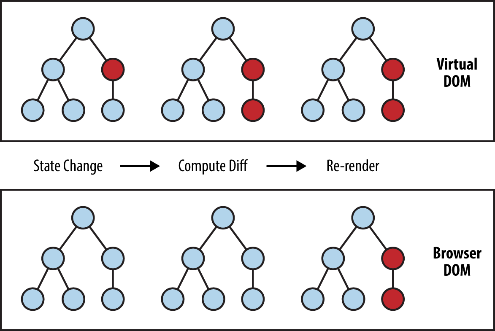

# Урок-1
## Концепция REACT, JSX и работа с состоянием useState()

### Базовая структура REACT

React - позволяет за счет сравнения виртуального дом-дерева(**Дерево элементов**) с реальным(**DOM-дерево**), обновлять только те компоненты на странице, которые были изменены.



Точкой входа в наше REACT приложение является `<div id="root">`, благодаря этому REACT предварительно компилирует весь
js код, а затем лишь подставляет отрендеренные компоненты на те места в дереве, которые были изменены.

#### index.html
```html
<!DOCTYPE html>
<html lang="en">
<head>
    <meta charset="utf-8"/>
    <meta name="viewport" content="width=device-width, initial-scale=1"/>
    <title>React App</title>
</head>
<body>
<noscript>You need to enable JavaScript to run this app.</noscript>
<div id="root">
</div>
</body>
</html>
```

#### index.js
```javascript
const root = ReactDOM.createRoot(document.getElementById('root'));
root.render(
<App />
);
```

### JSX и useState()

Компоненты создаются с использованием языка JSX, который позволяет писать html-код внутри js-файла.
Для изменения состояние элементов на странице используется функция useState(), которая работает, как некий слушатель события,
т.е. у нас значение(**count**), которое меняется с помощью возвращаемой функции (**setCount**)

####
```javascript
import React, { useState } from 'react';

function Example() {
    const [count, setCount] = useState(0);
    
    return (
        <div>
        <p>You clicked {count} times</p>
        <button onClick={() => setCount(count + 1)}>
        Click me
        </button>
    </div>
);
}
```


